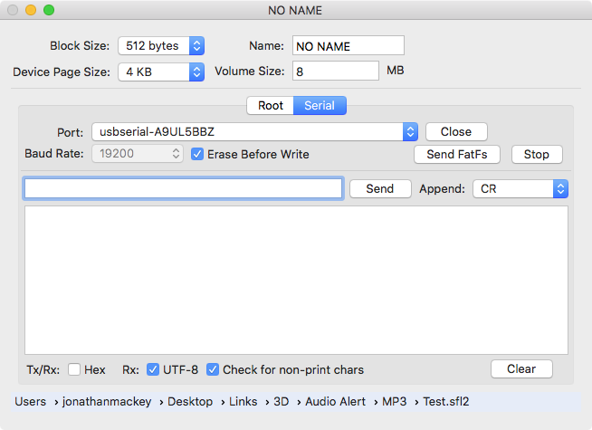

# FatFsToHex

FatFsToHex is a small Objective-C OS X app used to create a FAT file system to be sent serially in Intel HEX format to any compatible interpreter.

In my case the HEX is sent to an Atmel ATmega328p that unpacks and copies the blocks sent to a target device.  Currently this is either NOR Flash or an SD card.

The Intel HEX encoder code removes most runs of nulls.  For example, if most of the FAT file system is made up of empty blocks, little time is wasted sending this data.  To mark a block to be written as all nulls, only a single null byte is sent in the hex line that addresses this block. For this reason, the interpreter should zero the block buffer as part of its initialization for each new block.  Also, only blocks accessed by FatFs are included in the hex.  This has no effect on the filesystem, but some may find it annoying for debugging.  If this is the case then the device should be erased prior to loading the file system.

Code used in this project:
* [FatFs](http://elm-chan.org/fsw/ff/00index_e.html) by ChaN  
	Copyright (C) 2015, ChaN, all rights reserved.  
	[Github](https://github.com/abbrev/fatfs)  

* ORSSerialPort by Andrew Madsen  
	Copyright (c) 2014 Open Reel Software. All rights reserved.  
	[Github](https://github.com/armadsen/ORSSerialPort)  

FatFsToHex was written to get a FAT file system image onto a NOR Flash chip for use with Guangzhou Yuexin Electronic Technology's YX5200-24SS MP3 chip.  The YX5200-24SS is found on the ubiquitous DFPlayer module.  The DFPlayer module doesn't expose the pins needed to hookup the NOR Flash chip.  This is a shame because NOR Flash chips are much less expensive than even the smallest SD cards.  After some delecate soldering I was able to tack on the 3 wires required to connect the chip for initial testing.  It works, so now my Audio Alert project PCB contains a YX5200-24SS, and below it a Winbond W25Q64FVSSIG.

# Usage
   
Launch FatFsToHex.  The initial panel shown is for dropping files and folders to be loaded into the FAT root folder.  The order they appear in the list is the physical order in the file system.  Once in the list you can drag the files to change the order.  Files are removed by selecting a row and pressing the delete key.

There is no GUI past the root.  You can drag folders, and these folders will be iterated and files with them and any sub folders will be added in the order they are returned by the OS's enumerator.  Unlike the root, there is no way to set the physical order these files will appear in the file system.

The four fields above this panel define the FAT block size, the device page size, the volume name, and the volume size.  The device page size is an optimization hint to FatFs related to where it will locate blocks.  FatFs tries to keep the device pages contiguous and full.

Note that the type of FAT created by FatFs depends on the volume size (FAT16, FAT32, etc).  See the FatFs [f_mkfs](http://elm-chan.org/fsw/ff/doc/mkfs.html) documentation for more information.  If for some reason you need a FAT32 and your target device is tiny, provided you know that no illegal blocks are written to the target device, you can safely set a larger FS capacity.  FatFs only accesses the blocks needed to represent the file system.

Once you've defined the files and their physical order in the root folder, you can either export a hex file to disk so that you can use some other method of loading the  target device, or you can move to the Serial panel to load the data serially using the HexLoader sketch. 

Load the HexLoader sketch onto any Atmel ATmega328p.  Hookup the device to the 328p as per the pin settings in the sketch.  As currently configured, the baud rate is 9600 (anything higher and you may have overrun issues.)  The HexLoader sketch currently accepts the following commands, H, E, V, v, and j.  H starts a hex load session and E does a full erase on the target device.  When you press the Send FatFs button an H is automatically sent.  To do a full erase you need to type a capital E into the send text field and press send with append CR selected (to the right of the Send button).  The V command set a flag to do a read after write verify.  The v command turns verify off (default state.)  The j command reads and displays the NOR Flash JDEC information (a way of pinging the chip.)

For the H and E commands the HexLoader will respond with an asterisk.  During the hex load session you'll see several asterisks, one for each hex line processed.  If all lines are processed without error "Success!" will appear to mark the end of the session.  The session will also end if an error occurs with the associated error message displayed.

